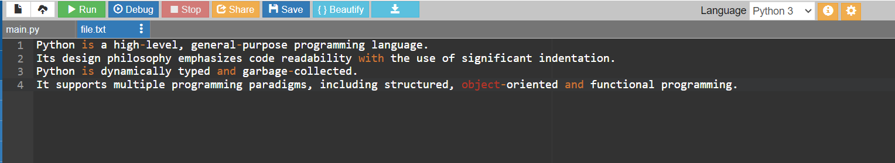

# Word-count
## AIM:
To write a python program for getting the word count from a text.
## EQUIPEMENT'S REQUIRED: 
PC
Anaconda - Python 3.7
## ALGORITHM: 
### Step 1:
Assign value for num_word
### Step 2: 
open the file in read mode
### Step 3: 
iterate using for loop
### Step 4:  
increment the word with length of the word
### Step 5: 
print the number of words in text
### Step 6: 
end the program
## PROGRAM:
```
'''
Developed by: GUTTHA KEERTHANA
Registered number: 212223240045
'''
num_words=0
with open('Word.txt','r') as f1:
    for i in f1:
        word=i.split()
        num_words += len(word)
print("Number of words in the file = {}".format(num_words))
```
### OUTPUT:




## RESULT:
Thus the program is written to find the word count from a text.
